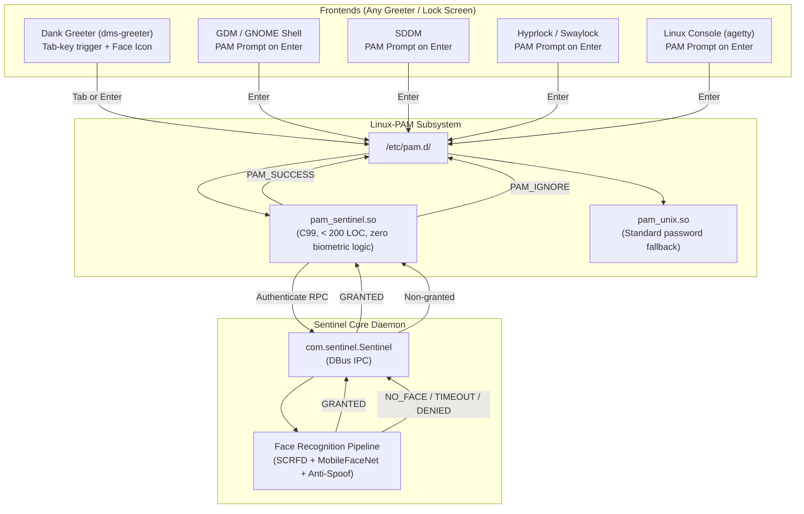

# Display Manager & Greeter Integration Guide — Sentinel Recreated

**Document**: `docs/GREETER_INTEGRATION.md`  
**Subsystem**: Display Managers, Greeters, Lock Screens & PAM Integration  
**Status**: Production Standard

---

## 1. Architectural Philosophy: Display-Manager Agnostic Core

Sentinel Recreated adheres strictly to a **display-manager agnostic architecture**:



### Core Invariants
1. **Zero Greeter-Specific Code in Authentication Path**: `pam_sentinel.c`, the Rust biometric pipeline (`sentinel-core`), and gallery stores contain no references to any specific greeter.
2. **Universal PAM Conversation**: `pam_sentinel.so` interacts with users exclusively via the standard PAM conversation function (`pam_conv`), prompting:
   ```text
   Sentinel face authentication requested - press Enter to scan (or enter password):
   ```
3. **Fail-Safe Passthrough (`PAM_IGNORE`)**:
   - If the user types their password into the prompt instead of pressing Enter, `pam_sentinel.so` preserves it in `PAM_AUTHTOK` and yields `PAM_IGNORE` immediately.
   - Standard password verification (`pam_unix.so`) authenticates the password seamlessly with **zero camera delay and zero extra keypresses**.
   - If face recognition fails, times out, detects spoofing, or encounters camera error, it returns `PAM_IGNORE`. **Biometrics can never lock a user out of their system**.

---

## 2. Supported Environments & Capabilities

| Greeter / Lock Screen | Primary PAM File | Tab-Key Trigger | Face Icon | Interaction Model |
|-----------------------|------------------|:---------------:|:---------:|-------------------|
| **Dank Greeter (`dms-greeter`)** | `/etc/pam.d/greetd` | ✅ **Supported** (PR #21) | ✅ **Supported** (PR #21) | Press `Tab` on empty password field to scan face |
| **Generic greetd (`agreety`, `tuigreet`, `gtkgreet`)** | `/etc/pam.d/greetd` | ❌ | ❌ | Press `Enter` on empty password field |
| **GDM (GNOME Display Manager)** | `/etc/pam.d/gdm-password` | ❌ (GNOME restriction) | ❌ | Press `Enter` on empty password field |
| **SDDM** | `/etc/pam.d/sddm` | ❌ | ❌ | Press `Enter` on empty password field |
| **LightDM** | `/etc/pam.d/lightdm` | ❌ | ❌ | Press `Enter` on empty password field |
| **Hyprlock** | `/etc/pam.d/hyprlock` | ❌ | ❌ | Press `Enter` on empty password field |
| **Swaylock** | `/etc/pam.d/swaylock` | ❌ | ❌ | Press `Enter` on empty password field |
| **Console TTY (login)** | `/etc/pam.d/login` | ❌ | ❌ | Press `Enter` on empty password field |

---

## 3. Dank Greeter Integration (`dms-greeter`)

Dank Greeter (part of Dank Material Shell / DMS) includes first-class upstream support for Sentinel Recreated via [PR #21](https://github.com/AvengeMedia/dank-greeter/pull/21).

### Native Features
1. **Tab-Key Trigger**:
   - Pressing `Tab` on an empty password input field immediately triggers `root.startAuthSession(false)`, invoking the PAM stack without typing a password.
   - If the user types a password, standard `Tab`/`Backtab` focus navigation is preserved.
2. **Visual Face Indicator**:
   - Dank Greeter inspects `/etc/pam.d/greetd` for `pam_sentinel` (as well as `pam_howdy` and `pam_face`).
   - If detected, `greeterPamHasFaceAuth` evaluates to `true`, displaying a face icon and tooltip (`"Face recognition"`) next to the input field.

### Configuration (`/etc/pam.d/greetd`)

Ensure `/etc/pam.d/greetd` contains `pam_sentinel.so` before `system-auth`:

```pam
#%PAM-1.0
auth       sufficient    pam_sentinel.so
auth       substack      system-auth
-auth      optional      pam_gnome_keyring.so
-auth      optional      pam_kwallet5.so
-auth      optional      pam_kwallet.so
auth       include       postlogin

account    required      pam_sepermit.so
account    required      pam_nologin.so
account    include       system-auth

password   include       system-auth

session    required      pam_selinux.so close
session    required      pam_loginuid.so
session    required      pam_selinux.so open
session    optional      pam_keyinit.so force revoke
session    required      pam_namespace.so
session    include       system-auth
-session   optional      pam_gnome_keyring.so auto_start
-session   optional      pam_kwallet5.so auto_start
-session   optional      pam_kwallet.so auto_start
session    include       postlogin
```

---

## 4. Other Greeters & Lock Screens

### GDM / GNOME Shell
- **PAM Service**: `/etc/pam.d/gdm-password`
- **Why Tab is not supported in GDM**:
  - In GNOME Shell's Clutter/St toolkit (`authPrompt.js` / `unlockDialog.js`), `Tab` is hardwired to focus navigation (`TAB_FORWARD`).
  - GNOME Shell does not provide plugin or D-Bus APIs for third-party biometric services in GDM mode (`--mode=gdm` explicitly disables user extensions for security).
- **How Sentinel works**:
  - Place `auth sufficient pam_sentinel.so` at the top of `/etc/pam.d/gdm-password`.
  - When the GDM password prompt appears, press `Enter` without typing anything to trigger face scanning.
  - If you type your password instead, Sentinel immediately passes it to `pam_unix.so`.

### Hyprlock
- **PAM Service**: `/etc/pam.d/hyprlock`
- **Configuration**:
  ```pam
  #%PAM-1.0
  auth       sufficient    pam_sentinel.so
  auth       include       system-auth
  account    include       system-auth
  ```
- **How to use**: Press `Enter` on the lock screen password prompt without typing text to unlock with your face.

### SDDM
- **PAM Service**: `/etc/pam.d/sddm`
- **Configuration**:
  ```pam
  #%PAM-1.0
  auth       sufficient    pam_sentinel.so
  auth       include       system-login
  account    include       system-login
  password   include       system-login
  session    include       system-login
  ```

---

## 5. Diagnostic Tools

Sentinel provides inspection tools to verify greeter status and configuration.

### CLI Inspection
Run `sentinel greeter-info`:

```bash
$ sentinel greeter-info

Greeter Detection
─────────────────
  Active Greeter:     Dank Greeter (dms-greeter)
  PAM Service:        /etc/pam.d/greetd
  Sentinel in PAM:    ✓ pam_sentinel.so configured
  Tab-key Trigger:    ✓ Supported (upstream PR #21)
  Face Auth Icon:     ✓ Displayed in greeter

  Status: Native Tab-key face authentication and face icon active (upstream PR #21). Press Tab on an empty password field to scan face.
```

For JSON output (suitable for scripts or monitoring):

```bash
$ sentinel greeter-info --json
{
  "greeter_type": "DankGreeter",
  "greeter_name": "Dank Greeter (dms-greeter)",
  "has_tab_trigger": true,
  "has_face_pam_icon": true,
  "pam_service": "greetd",
  "pam_service_path": "/etc/pam.d/greetd",
  "sentinel_pam_configured": true,
  "setup_hint": "Native Tab-key face authentication and face icon active (upstream PR #21). Press Tab on an empty password field to scan face."
}
```

### DBus Interface
The daemon exposes a read-only method on the system bus:
- **Interface**: `com.sentinel.Sentinel`
- **Object Path**: `/com/sentinel/Sentinel`
- **Method**: `GetGreeterInfo() -> (String)` (returns serialized JSON identical to above)

Example call via `busctl`:
```bash
busctl call com.sentinel.Sentinel /com/sentinel/Sentinel com.sentinel.Sentinel GetGreeterInfo
```

---

## 6. Troubleshooting & FAQ

### 1. `pam_sentinel.so` is not triggering
- **Check PAM service file**: Run `sentinel greeter-info` to verify which PAM service file corresponds to your active display manager, and whether `pam_sentinel.so` is detected.
- **Check module position**: Ensure `auth sufficient pam_sentinel.so` is placed **above** `auth substack system-auth` or `pam_unix.so`.
- **Check daemon status**: Run `systemctl status sentinel.service` to ensure the core daemon is active.

### 2. Can biometric authentication lock me out?
**No, by design.** `pam_sentinel.c` guarantees:
- Non-granted results (`NO_FACE`, `TIMEOUT`, `DENIED`, `SPOOF`, camera error, DBus disconnection) always return `PAM_IGNORE`.
- Only an authenticated `GRANTED` result returns `PAM_SUCCESS`.
- `PAM_AUTH_ERR` is never returned for recognition misses, ensuring `pam_faillock` or `pam_tally2` do not increment failed password attempt counters.

### 3. I want to remove greeter detection code
The greeter detection module is completely decoupled:
- `sentinel-core/src/greeter_detect.rs` and `sentinel_py/greeter_info.py` can be removed without modifying the recognition pipeline or PAM bridge.
- The core authentication engine operates strictly through standard PAM and DBus protocols.
